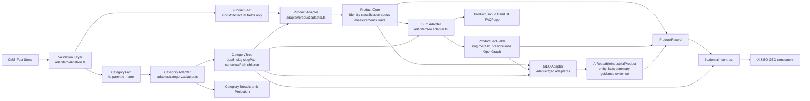

# CMS Fact Layer to Domain Adapter Flow

## Enforcement

- CMS may provide `CategoryFact` only as `id`, `parentId`, and `name`.
- CMS may provide product facts only as raw ids, category ids, measurements, environmental limits, specs, documents, media assets, certifications, and commercial terms.
- CMS-provided `slug`, `slugPath`, `canonicalPath`, `categoryPath`, `jsonld`, `jsonLd`, `jsonLD`, `seo`, `geo`, `geoAi`, `geoEntity`, `children`, `breadcrumb`, and `depth` are rejected at runtime.
- Category consistency is verified before tree generation: single root, valid parents, no cycles, max depth 4, and unique generated sibling slugs.
- Product consistency is verified before record generation: valid category ids, unique ids/skus/model slugs, measurement kind alignment, overload limits, media/temperature limits, and evidence documents.
