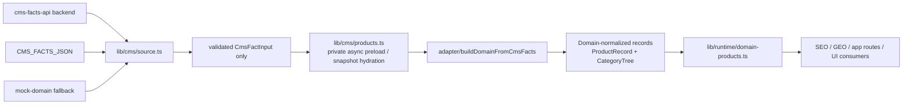

# CMS Runtime Wiring Decision

## Scope

This decision covers the Phase 3 runtime wiring between `lib/cms/source.ts`, `lib/cms/products.ts`, and `lib/runtime/domain-products.ts`.

It does not change Architecture Freeze v1, Domain contracts, UI behavior, or Strapi implementation details.

## Decision

Use an **approved async preload boundary** inside `lib/cms/products.ts` as the canonical live-CMS wiring path.

Keep `lib/runtime/domain-products.ts` as the stable public runtime facade and keep its consumer contract synchronous for now.

Allow an internal async runtime boundary only for snapshot hydration inside the CMS layer, not as a new public product API surface.

In practice:

- live CMS facts may enter the system asynchronously
- public consumers still read Domain-normalized records through `lib/runtime/domain-products.ts`
- no public layer should depend on raw CMS transport or raw `CmsFactInput`

## Why This Decision

This is the lowest-risk path under Architecture Freeze v1 because it:

- avoids pushing async complexity into SEO, GEO, UI, and public API call sites
- keeps the public runtime facade stable
- keeps all CMS transport details behind `lib/cms/*`
- preserves the current Domain-normalized output shape
- matches the existing boundary policy that `lib/cms/products.ts` is the only bridge from CMS facts to Domain records

## Approved Runtime Flow

## How `cms-facts-api` Enters `lib/cms/products.ts`

The live facts path is allowed only through the source adapter boundary.

Required entry conditions:

1. `CMS_SOURCE_MODE=cms-facts-api` is selected.
2. `CMS_FACTS_API_URL` points to the backend-only facts endpoint.
3. `CMS_FACTS_API_ALLOW_FETCH=true` is enabled when live fetch is intended.
4. `lib/cms/source.ts` performs the fetch, timeout handling, and response normalization.
5. The direct response body is validated as exact `CmsFactInput`.
6. `lib/cms/products.ts` receives only the normalized `CmsFactInput` plus source metadata.
7. `buildDomainFromCmsFacts(cmsFacts)` converts the payload into Domain records.
8. The raw CMS facts are discarded after normalization and must not escape the `lib/cms/*` boundary.

Important rule:

- `lib/cms/products.ts` may cache normalized records, category tree, catalog indexes, and source metadata
- it must not cache or export raw CMS transport envelopes
- it must not export `CmsFactInput` to public runtime consumers

## What `lib/cms/products.ts` May Expose

`lib/cms/products.ts` may expose only Domain-normalized or operationally safe outputs:

- `ProductRecord[]`
- `CategoryTree`
- `ProductCatalogIndex`
- `ProductListResult`
- source metadata and readiness metadata
- status-only information for `app/api/cms/status/route.ts`

It must not expose:

- raw Strapi envelopes
- raw CMS response bodies
- raw `CmsFactInput`
- generated SEO or GEO artifacts as CMS source data
- UI view models
- route-specific response envelopes

## Async Boundary Rule

The approved async mechanism is **private hydration**, not a public async product API.

That means:

- `lib/cms/products.ts` may asynchronously hydrate a private snapshot cache
- once hydrated, public runtime reads can continue to use the cached Domain snapshot
- the public facade should not force all current callers to become async just to support live CMS wiring
- if a future request path truly needs per-request refresh, that async path must stay inside the CMS layer and still return only Domain-normalized records

Decision intent:

- async belongs at the CMS snapshot hydration edge
- sync belongs at the runtime facade edge

## Modules That Must Continue To Depend Only On `lib/runtime/domain-products.ts`

These module groups must keep reading products through the runtime facade and must not import `lib/cms/products.ts` directly:

| Module group | Rule |
| --- | --- |
| `components/**` | Use `lib/runtime/domain-products.ts` or view models only. No direct CMS or adapter imports. |
| `app/[locale]/**` | Use `lib/runtime/domain-products.ts` and domain projections only. No raw CMS access. |
| `lib/seo/**` | Use Domain-normalized records only. No direct CMS access. |
| `lib/geo/**` | Use Domain-normalized records only. No direct CMS access. |
| `app/api/**` public routes | Use the runtime facade unless the route is an operational CMS metadata route. |
| `lib/api/**` public helpers | Use the runtime facade only. |

Operational exception:

- `app/api/cms/status/route.ts` may import `getCmsProductStatus()` from `lib/cms/products.ts` because it returns metadata only.
- It must not expose raw facts or transport payloads.

Additional rule:

- `lib/runtime/domain-products.ts` remains the single public product runtime facade.
- `lib/cms/products.ts` remains an internal CMS bridge, not a public dependency target for UI or SEO/GEO code.

## Boundary Ownership

| Layer | Owns | May depend on |
| --- | --- | --- |
| `lib/cms/source.ts` | Source selection, fetch, timeout, normalization, fallback metadata | Environment config, `CmsFactInput`, adapter-safe validation helpers |
| `lib/cms/products.ts` | Private snapshot hydration, domain build, cache, operational status | `lib/cms/source.ts`, adapter build path, domain types |
| `lib/runtime/domain-products.ts` | Public runtime facade for normalized product data | `lib/cms/products.ts`, domain types |
| `lib/seo/**` and `lib/geo/**` | Derived outputs only | `lib/runtime/domain-products.ts`, domain types |
| UI and app routes | Consumption only | `lib/runtime/domain-products.ts`, view models |

## Fallback Policy

The source order remains the same:

1. `cms-facts-api`
2. `env-facts-json`
3. `mock-domain`

But the decision boundary changes how the source is consumed:

- the async source fetch happens in `lib/cms/source.ts`
- the selected payload is normalized before it reaches runtime
- the runtime facade never sees raw upstream transport

Failure states must stay visible through metadata:

- requested mode
- active mode
- source version
- fallback reason
- endpoint readiness flags

Silent fallback is acceptable only as an operational fallback, not as a hidden contract change.

## Non-Goals

This decision does not:

- add new Domain fields
- change Architecture Freeze v1
- introduce Strapi transport into public layers
- make SEO or GEO consumers talk to CMS directly
- change the shape of `ProductRecord` or `CategoryTree`
- require UI code to become CMS-aware

## Acceptance Criteria

This wiring decision is acceptable only if all of the following remain true:

- live CMS input enters through `lib/cms/source.ts` as exact `CmsFactInput`
- `lib/cms/products.ts` emits Domain-normalized records only
- `lib/runtime/domain-products.ts` remains the public product facade
- public modules continue to avoid direct CMS imports
- `app/api/cms/status/route.ts` stays metadata-only
- no raw CMS envelope or raw facts escape `lib/cms/*`
- Architecture Freeze v1 stays unchanged

## Final Statement

Approve async preload inside `lib/cms/products.ts` as the live CMS wiring path.

Keep the runtime facade public, synchronous, and Domain-only.

That gives us live CMS connectivity without turning the rest of the system into a moving async target.
