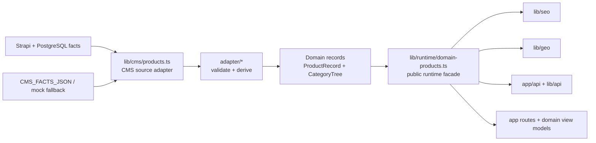

# Domain Runtime Facade Plan

Date: 2026-06-25
Role: Principal Architect thread
Scope: Architecture Freeze v1 runtime boundary

## Verdict

The current runtime facade is still sufficient for the next CMS integration step, and it must remain the single public runtime access point for domain-normalized product data.

`lib/runtime/domain-products.ts` can support real Strapi/PostgreSQL facts because its exported surface already hides CMS source details and returns only `ProductRecord`, `CategoryTree`, `ProductCatalogIndex`, `ProductListResult`, and source metadata. The current implementation delegates to `lib/cms/products.ts`; that delegation is acceptable as an internal bridge, not as a dependency pattern for SEO, GEO, API, UI, or page code.

Current code state: `lib/cms/source.ts` already contains the async `cms-facts-api` request, fetch, timeout, response-normalization, and fallback path. However, `lib/cms/products.ts` still builds the runtime snapshot through the synchronous source reader, so live CMS facts are not active through the public runtime facade yet.

The next phase must keep the directory structure unchanged and wire the existing CMS source path behind the facade through an approved async preload or async runtime boundary, rather than letting downstream consumers read Strapi directly.

## Long-Term Boundary

## `lib/runtime/domain-products.ts` Responsibilities

The runtime facade owns the public server-side read model for product data.

It may:

- Return domain-normalized product records through `getRuntimeDomainProductRecords()`.
- Return the generated category tree through `getRuntimeDomainCategoryTree()`.
- Return locale catalog indexes through `getRuntimeDomainProductCatalog(locale)`.
- Return filtered list results through `listRuntimeDomainProducts(locale, query)`.
- Return homepage product lists through `listRuntimeDomainHomepageProducts(locale)`.
- Return source metadata through `getRuntimeDomainProductSource()` and `getRuntimeDomainProductSourceVersion()`.
- Hide whether upstream data came from mock domain records, `CMS_FACTS_JSON`, internal CMS facts, or live `cms-facts-api` aggregation.

It must not:

- Return raw CMS facts.
- Return Strapi response envelopes, Strapi IDs, draft state, upload metadata, or relation payloads.
- Build UI view models.
- Generate SEO, JSON-LD, GEO, slugs, canonical paths, or breadcrumbs itself.
- Import route handlers, React components, or client modules.
- Expose transport details such as REST URLs, GraphQL query shapes, database tables, or cache headers.

## `lib/cms/products.ts` Responsibilities

The CMS source adapter owns upstream product fact loading and adapter invocation.

It may:

- Read the current mock-domain fallback.
- Read `CMS_FACTS_JSON` and validate it as `CmsFactInput`.
- Read `CMS_SOURCE_MODE` and `CMS_FACTS_API_*` configuration for source metadata and readiness checks.
- Report the requested source mode separately from the currently active runtime mode.
- Use the async `cms-facts-api` source path only after an approved async preload or async runtime boundary is added behind this module.
- Call `buildDomainFromCmsFacts(cmsFacts)`.
- Cache generated `ProductRecord[]`, `CategoryTree`, and `ProductCatalogIndex` values for the current runtime process.
- Report source status to `app/api/cms/status/route.ts`.

It must not:

- Export raw facts to public runtime consumers.
- Store or accept CMS-authored slugs, canonical paths, breadcrumbs, SEO, JSON-LD, or GEO.
- Define product semantics outside `lib/domain`.
- Build UI view models or public API response envelopes.
- Know about page routes, app directory UI files, or SEO/GEO endpoint contracts.
- Depend on `lib/seo`, `lib/geo`, `components`, or `app`.

## Allowed Consumer Interfaces

SEO, GEO, API, and route-level code may depend on these runtime facade functions:

- `getRuntimeDomainProductRecords()`
- `getRuntimeDomainCategoryTree()`
- `getRuntimeDomainProductCatalog(locale)`
- `listRuntimeDomainProducts(locale, query)`
- `listRuntimeDomainHomepageProducts(locale)`
- `getRuntimeDomainProductSource()`
- `getRuntimeDomainProductSourceVersion()`

They may also depend on pure domain contracts from `lib/domain`, such as:

- `ProductRecord`
- `CategoryTree`
- `ProductCatalogIndex`
- `ProductFilterQuery`
- `ProductListResult`
- `ProductSeoFields`
- `ProductGeoAiProfile`
- domain page view models

## Forbidden Dependency Rules

These imports are forbidden outside their owning layers:

| Consumer | Forbidden imports |
| --- | --- |
| `components/**` | `@/lib/cms/*`, `@/adapter/*`, raw Strapi clients, `CMS_FACTS_JSON` |
| `app/[locale]/**` pages | raw Strapi clients, `CMS_FACTS_JSON`, direct adapter calls, CMS fact types |
| `lib/seo/**` | raw Strapi clients, `CMS_FACTS_JSON`, CMS fact types, direct adapter calls |
| `lib/geo/**` | raw Strapi clients, `CMS_FACTS_JSON`, CMS fact types, direct adapter calls |
| `lib/api/**` | raw Strapi clients unless creating a private CMS integration module; no raw public output |
| `app/api/**` public routes | raw Strapi JSON responses, CMS fact passthrough, direct ProductFact exposure |

Allowed exception:

- `app/api/cms/status/route.ts` may read `getCmsProductStatus()` for operational status only. It must not expose raw facts or Strapi transport objects.

## Real CMS Integration Shape

When Strapi/PostgreSQL is connected, the change belongs behind `lib/cms/products.ts` or a private helper imported only by it.

Expected flow:

1. Strapi stores facts only.
2. A backend-only aggregator emits `CmsFactInput`.
3. `lib/cms/source.ts` fetches and normalizes that payload when `cms-facts-api` is enabled.
4. `lib/cms/products.ts` receives that `CmsFactInput` through an approved async preload or async runtime boundary.
5. `buildDomainFromCmsFacts(cmsFacts)` validates and derives domain records.
6. `lib/runtime/domain-products.ts` exposes only normalized domain outputs.
7. SEO, GEO, API, and UI continue using the runtime facade and domain projections.

This flow preserves Architecture Freeze v1 because Strapi remains a fact layer and cannot become a second domain model.

## Readiness Assessment

Current readiness: ready for real CMS integration work and controlled runtime-wiring design, but not ready for production live CMS traffic.

Ready now:

- Runtime facade hides the upstream source mode.
- Source metadata can distinguish requested mode, active mode, endpoint readiness, and fetch readiness without exposing raw facts.
- `lib/cms/source.ts` has the async `cms-facts-api` request, fetch, timeout, response-normalization, and fallback path.
- CMS source adapter converts facts into domain records.
- Adapter rejects generated CMS fields.
- SEO/GEO/API can use domain-normalized records through the runtime facade.
- Public API contracts already describe domain-first runtime output.

Still required before live CMS:

- Internal Strapi facts aggregator implementation that returns exact `CmsFactInput`.
- Approved async preload or async runtime boundary inside `lib/cms/products.ts` so live `cms-facts-api` facts can reach the runtime snapshot without exposing raw facts.
- Operational observability for failed facts fetch or adapter validation.
- Cache invalidation rules tied to signed CMS publish webhooks.
- Preview-mode source selection that still runs through the adapter.
- CI validation of real CMS exports through `CMS_FACTS_JSON` or file-based facts validation.

## Acceptance Rules For Future Threads

A future CMS integration change is acceptable only if all statements are true:

- `npm run validate:cms-facts` accepts the aggregated facts.
- `npm run validate:domain` accepts the derived records.
- `npm run validate:boundaries` stays green for `components`, `app/[locale]`, `lib/seo`, and `lib/geo`.
- SEO and GEO commands still pass without importing Strapi or raw facts.
- UI files do not import `lib/cms`, `adapter`, or raw fact types.
- `lib/runtime/domain-products.ts` remains the public product runtime facade.
- `lib/cms/products.ts` remains the only product source adapter exposed to the runtime facade.

## Thread Ownership

- Architecture thread owns this boundary document and resolves dependency disputes.
- CMS thread owns facts-only Strapi schema and internal facts aggregation.
- Data Pipeline thread owns export validation and scale checks.
- SEO/GEO thread owns domain-only output generation.
- API/System Integration thread owns public route envelopes and revalidation contracts.
- Frontend thread owns UI consumption through view models only.
- DevOps thread owns CI gates that enforce the boundary, including `npm run validate:boundaries`.
