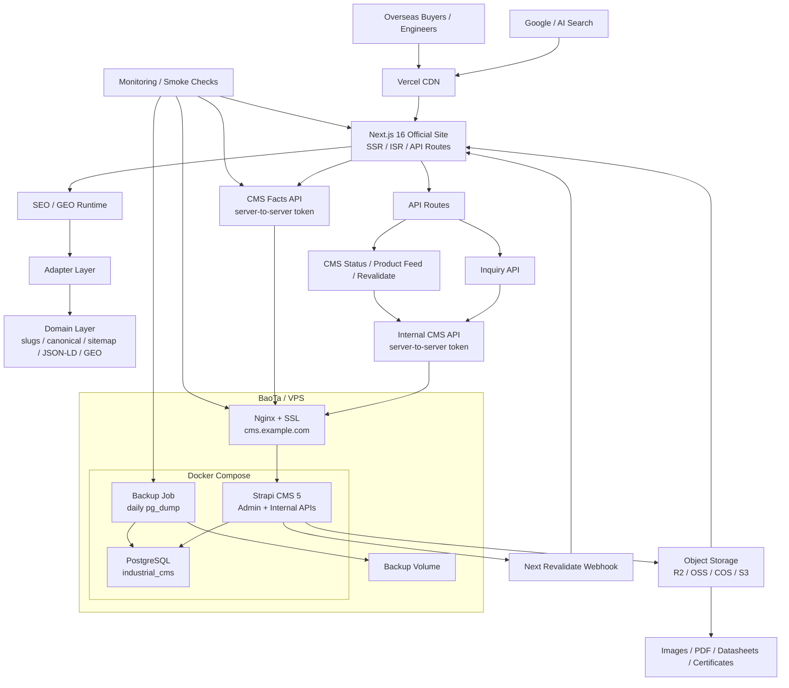

# Final Deployment Architecture

This architecture is the accepted deployment target for the pre-test, staging, and production launch phases.

## Objective

The site is an industrial B2B official website for overseas buyers, engineers, OEM customers, distributors, and AI/search discovery. It must support product selection, technical resource access, SEO/GEO visibility, inquiry conversion, and ongoing Strapi-driven content operations with low maintenance overhead.

## Architecture

## Boundaries

- Strapi owns editorial facts, inquiry records, PostgreSQL data, and media references.
- Strapi does not own generated slugs, canonical paths, SEO, JSON-LD, GEO payloads, or product domain identity.
- The adapter/domain layers generate and validate frontend-facing product records, SEO, GEO, sitemap, hreflang, and structured data.
- Internal CMS routes are server-to-server only and must use shared tokens.
- Vercel serves the public website. BaoTa/VPS serves the private CMS runtime behind Nginx.
- Object storage is the durable source for product images, manuals, certificates, PDFs, and datasheets.
- PostgreSQL backups must not exist only inside the active database volume; they must be exported and copied off the server during production operations.

## Pre-Test Target

The pre-test deployment must prove:

- `preview.example.com` can render the Next.js site from Vercel.
- `cms.example.com/admin` can load Strapi through BaoTa/Nginx.
- `preview.example.com` can read protected Strapi facts through server-side token config.
- Inquiry submissions are persisted to Strapi `inquiry-submission`.
- Media uploads resolve from object storage.
- ISR/revalidate works after Strapi publish events.
- Smoke checks pass for website, CMS, sitemap, robots, inquiry contract, and facts API.
